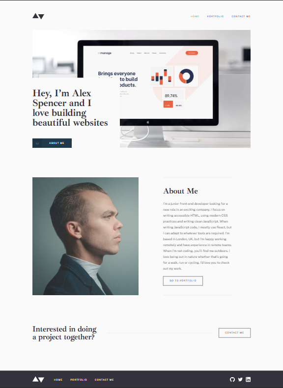

# Minimalist portfolio website

## Table of contents

- [Overview](#overview)
  - [Screenshot](#screenshot)
  - [Links](#links)
- [My process](#my-process)
  - [Built with](#built-with)
- [Author](#author)

## Overview

### Screenshot

### Links

- Solution URL: [Solution URL](https://github.com/kisu-seo/minimalist_portfolio_website)
- Live Site URL: [Live URL](https://kisu-seo.github.io/minimalist_portfolio_website/)

## My process

### Built with

- **Semantic HTML5 & Accessibility (A11y)** — Built with semantic tags (`<header>`, `<main>`, `<nav>`, `<footer>`), ARIA attributes (`aria-label`, `aria-current`, `aria-haspopup`, `aria-expanded`, `role="alert"`), and keyboard-accessible, focus-visible interactive controls throughout.
- **CSS Custom Properties (Design Tokens)** — Centralized color, typography, and spacing tokens in `:root`, mapped 1:1 from the provided style guide.
- **Mobile-first Responsive Design** — Layouts built mobile-first, then expanded with `@media (min-width: 48em)` and `@media (min-width: 64em)` breakpoints for tablet and desktop.
- **Vanilla JavaScript (ES Modules)** — Framework-free DOM manipulation for the mobile navigation toggle and contact form validation.
- **Vite** — Multi-page static site build tool, with each HTML page registered as its own entry point.

## Author

- Website - [Kisu Seo](https://github.com/kisu-seo)
- Frontend Mentor - [@kisu-seo](https://www.frontendmentor.io/profile/kisu-seo)
